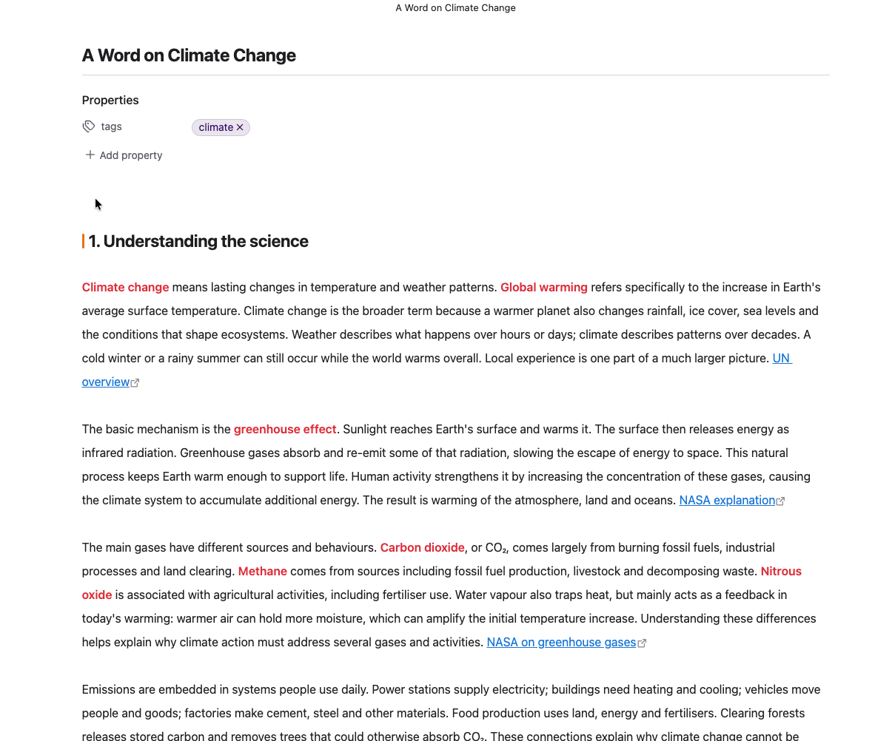

# AI Overview for Obsidian

Write a prompt inside a note and embed the result alongside it. AI Overview uses
a locally installed [Codex CLI](https://github.com/openai/codex),
[Claude Code](https://claude.com/claude-code), or [opencode](https://opencode.ai)
to carry out your request and save the generated content as a Markdown callout.



Use it to embed any Markdown content the agent can produce: summaries, action
items, comparisons across notes, drafts, tables, and more. The agent can draw on
other notes in your vault, internet sources, and any other resources it can
access. Vault notes do not need to be linked; internet access depends on the
agent's available tools and permissions. Results are saved in the note itself,
so they can sync to other devices and remain readable with the plugin disabled.

## Requirements

- **Obsidian desktop.** The manifest declares Obsidian 1.5.0 or later. Generation
  is unavailable on mobile because the plugin starts a local CLI process.
- **One supported CLI, installed and authenticated.** Set it up using the linked
  CLI documentation above and confirm it works in a terminal before using the
  plugin. The plugin does not install a CLI or sign you in.
- **Agent access to your Obsidian vault.** For the plugin to work, the agent must
  be able to read your notes through **either an enabled Obsidian CLI that it is
  permitted to use, or direct file access with knowledge of the vault directory**.
  The plugin automatically supplies the vault directory and the current note's
  absolute path for direct file access; the agent still needs permission to read
  those files.
- **Access to a model through your chosen CLI.** Network access and any account,
  subscription, or API charges depend on your CLI and model provider.

If your agent setup uses the **Obsidian CLI**, enable **Settings → General →
Command line interface** and follow the registration instructions. Your agent's
tools and permissions must allow it to invoke the CLI. See the
[Obsidian CLI setup guide](https://obsidian.md/help/cli) for supported versions and
setup details. Direct file access works without enabling the Obsidian CLI.

Running the CLI locally does not mean the model runs locally: a hosted model may
receive your prompt, note content, and any other files the agent reads. See
[Privacy and file access](#privacy-and-file-access).

## Installation

### Manual installation

1. Download `main.js`, `manifest.json`, and `styles.css` from a release on the
   [Releases page](https://github.com/deepal/obsidian-ai-overview/releases).
   If release files are not available yet, [build from source](#development).
2. Create an `ai-overview` folder inside your vault's plugin directory. With the
   default Obsidian configuration folder, this is
   `<vault>/.obsidian/plugins/ai-overview/`.
3. Copy all three files into that folder, then restart Obsidian.
4. In **Settings → Community plugins**, turn on community plugins if needed and
   enable **AI Overview**.

Once the plugin is available in the community directory, you can install it
through **Settings → Community plugins → Browse** by searching for **AI Overview**.
See [Obsidian's installation guide](https://obsidian.md/help/Extending%2BObsidian/Community%2Bplugins).

## Your first overview

1. Open **Settings → AI Overview** and select your **Agent CLI**. Codex is the
   default. If Obsidian cannot find the executable, set its full path in the
   corresponding CLI path field.
2. Leave **Model** and the effort setting at **CLI default** to use your CLI's
   configuration. Add any required API keys under **Environment variables**.
3. Open a note with some content. In the command palette, run
   **AI Overview: Insert AI callout**, or paste this in Source mode:

   ```markdown
   > [!ai]
   > What are the delivery risks described in this note?
   ```

4. Move the cursor outside the callout and pause. The plugin generates an answer
   automatically. You can follow progress in the callout header and status bar.
5. Read the answer in Reading view or Live Preview. Switch to Source mode to
   edit the prompt.

For example, the saved Markdown might look like this:

```markdown
> [!ai] Delivery risks
> What are the delivery risks described in this note?
>
> > [!summary] <!-- ai codex/default 2026-10-05T10:00:00.000Z 14123b01 title -->
> > Pending budget sign-off could delay or block Friday's planned release.
```

The plugin hides the prompt in rendered callouts and displays the answer beneath
the outer title. The nested summary's header and border are also hidden. The
prompt and metadata remain in the Markdown; with the plugin disabled, Obsidian
shows the ordinary nested callouts instead.

You can write a title yourself, such as `> [!ai] Action items`, and use a prompt
across several quoted lines. Keep a `>` on every prompt line, including blank
lines, and put an unquoted blank line between separate callouts.

### Example prompts

Reference specific notes, ask the agent to find relevant material in the vault,
or combine your notes with internet sources:

```markdown
> [!ai] Project comparison
> Compare this note with [[Project plan]] and [[Meeting notes]]. Highlight disagreements and unresolved decisions.

> [!ai] Related research
> Find other notes in this vault about this topic and synthesise their main findings. Link to the notes you use.

> [!ai] Research update
> Use this note and recent internet sources to write an update on this topic. Include links to the sources you use.
```

## When answers update

- **Automatic generation:** enabling the plugin, opening a note, or modifying a
  Markdown note triggers a check. A non-empty `[!ai]` prompt generates an answer
  if its summary is missing or its prompt has changed. Checks after edits wait
  about 2.5 seconds.
- **Existing answers are reused:** changing other content in the note, a linked
  note, the CLI, model, or effort setting does **not** make an answer stale.
  Use a regenerate command when you want it to reflect those changes.
- **Cursor protection:** automatic generation is deferred while the cursor is
  inside a callout in the active editor. The whole-note regeneration command
  skips that callout, so move the cursor outside it before running the command.
  The explicit regenerate-at-cursor command runs immediately.
- **Titles:** an untitled callout receives a generated title. A title you supply
  before generation is preserved. Titles previously generated by the plugin can
  be replaced on later runs, even if you have since edited them.
- **Failed runs:** the same failed prompt is not retried automatically during the
  current plugin session. After fixing the cause, use a regenerate command.

Generation writes to the note file and may replace an earlier generated answer.
These changes appear in sync traffic and version-control diffs. Editing an answer
does not pin it while its metadata comment remains.

### Keep an answer unchanged

In Source mode, remove the `<!-- ai … -->` comment from the nested `[!summary]`
header. The plugin treats a summary without that comment as hand-written and
leaves it alone, including when you use a regenerate command.

To allow generation again, delete the nested summary callout, keeping the outer
`[!ai]` callout and its prompt.

## Commands

Search for **AI Overview** in Obsidian's command palette. You can assign hotkeys
under **Settings → Hotkeys**.

| Command | What it does |
| --- | --- |
| Insert AI callout | Inserts an empty callout and places the cursor on the prompt line. |
| Regenerate AI overview at cursor | Generates a fresh answer for the callout containing the cursor. |
| Regenerate every AI overview in this note | Regenerates callouts with non-empty prompts, preserving summaries without metadata. Skips the callout containing the active cursor; move outside it before running this command. |
| Show AI Overview status for this note | Shows detected callouts, generation state, and recorded errors. |

## Settings

| Setting | Purpose |
| --- | --- |
| Agent CLI | Codex CLI (default), Claude Code CLI, or opencode CLI. |
| CLI path | Executable name or absolute path. For a bare name, the plugin searches the inherited `PATH` plus common macOS/Linux install directories. |
| Model | A dropdown for Codex and opencode, or a text field for Claude Code. **CLI default** or an empty field leaves the choice to the CLI. |
| Reasoning effort / Effort level / Model variant | Available thinking levels reported by the selected CLI. **CLI default** leaves the choice to the CLI. |
| Extra arguments | Additional arguments passed to the selected CLI's generation command. Quoted values are kept together. |
| Environment variables | One `KEY=VALUE` per line, added to the CLI's inherited environment. Shared across CLIs. |
| Timeout | Maximum generation time in seconds. Default: **300** (five minutes). |

Path, model, effort, and extra arguments are saved separately for each CLI.
Changing the model can reset an incompatible effort selection to **CLI default**.

Obsidian may not inherit environment variables exported in your terminal. Set
required variables here if the CLI cannot authenticate from Obsidian. These
values are stored **in plain text** in the plugin's `data.json`, normally at
`<vault>/.obsidian/plugins/ai-overview/data.json`.

For opencode's Google provider, the plugin also accepts `GEMINI_API_KEY` as an
alias when `GOOGLE_GENERATIVE_AI_API_KEY` is not already set.

### Model and effort discovery

The plugin asks the installed CLI for its available options rather than shipping
a fixed model list:

| CLI | Model discovery | Effort discovery |
| --- | --- | --- |
| Codex | `codex debug models`; hidden entries are omitted | Each model's `supported_reasoning_levels` |
| Claude Code | Manual entry | Choices parsed from `claude --help` |
| opencode | `opencode models --verbose` | Each model's `variants` |

Results are cached for the plugin session. For Codex and opencode, use the refresh
button beside **Model** to ask again. Reloading the plugin also clears the cache.
Discovery depends on your CLI version supporting these commands and output
formats. If it fails, **CLI default** remains available.

## Privacy and file access

Each agent runs non-interactively with the vault root as its working directory.
The plugin supplies the note's absolute path and asks the agent to read it first,
following wikilinks or relative links only when the request needs them. The agent
can also find and read other accessible content in the vault without a link from
the current note. File discovery and link resolution depend on the agent.
The working directory is not itself a boundary on what files the CLI can read.

The plugin asks every agent not to modify files. Its default invocation also:

- runs **Codex** with `--sandbox read-only` and `--ephemeral`;
- gives **Claude Code** `--allowed-tools Read,Grep,Glob` and
  `--disallowed-tools Edit,Write,NotebookEdit,Bash`;
- gives **opencode** no enforced read-only flag, so it relies on the prompt and
  your opencode permissions.

These are the plugin's default restrictions, not a universal guarantee about
every CLI configuration or tool. Extra arguments and CLI configuration can
change the agent's behavior and permissions. The plugin itself writes the final
answer into your note.

### Response format and metadata

Codex receives a JSON schema through `--output-schema`; Claude Code and opencode
are asked for a JSON object containing `title` and `body`. If the final response
does not match that shape, the plugin saves it as the body without a generated
title.

The `<!-- ai … -->` comment records the CLI, the configured model override (or
`default` when the CLI chooses), generation time, and a hash of the prompt. It
does not record the resolved default model or the contents of the note. The
optional `title` flag marks the outer title as generated and replaceable.

## Troubleshooting

- **Nothing happens:** check that the prompt is non-empty and move the cursor
  outside the callout. Run **Show AI Overview status for this note** to check
  whether it needs generation or has a recorded error.
- **CLI not found:** confirm it works in your terminal, then set an absolute
  executable path in the plugin settings.
- **Authentication fails:** complete the CLI's own login or add its required
  environment variables in the plugin settings, then regenerate.
- **Answer is out of date:** regenerate after changing the note or linked notes.
  Only prompt changes trigger an automatic refresh of an existing answer.
- **Regeneration leaves a summary alone:** a summary without an `<!-- ai … -->`
  comment is protected. Delete that nested summary to allow generation again.
- **Run times out:** increase **Timeout**, or simplify the prompt, then regenerate.

Errors also appear in Obsidian's developer console with an `[ai-overview]` prefix.
Report reproducible problems on the
[issue tracker](https://github.com/deepal/obsidian-ai-overview/issues), including
your Obsidian version, CLI name/version, and the error. Remove API keys and private
note content from reports.

## Development

Building from source requires Node.js and npm. Use a Node.js version that supports
`--experimental-strip-types` to run the tests
([Node.js 22.6](https://nodejs.org/en/blog/release/v22.6.0) or later).

From a local checkout of this repository:

```bash
npm ci --legacy-peer-deps
npm run build
npm test
```

The current dependencies have a CodeMirror/Obsidian peer-version conflict, so the
install command above bypasses peer-dependency resolution. `npm run build`
type-checks and bundles the plugin into `main.js`. Copy it, `manifest.json`, and
`styles.css` into your vault as described in [Installation](#installation).

For automatic deployment to a test vault with the default `.obsidian`
configuration folder, set `OBSIDIAN_VAULT_DIR` to the vault root:

```bash
export OBSIDIAN_VAULT_DIR="/path/to/test-vault"
npm run dev
```

The watcher rebuilds JavaScript and copies the three plugin files into
`<vault>/.obsidian/plugins/ai-overview/`. It also watches `manifest.json` and
`styles.css` for copying. Reload the plugin in Obsidian to load JavaScript changes.
The production build also deploys when that variable is set; without it, builds
skip deployment.

Tests cover callout parsing, Markdown write-back, response parsing, provider
arguments/events, and model/effort discovery parsing. They do not run real agents
or verify the interface inside Obsidian.

For a release, attach the built `main.js`, `manifest.json`, and `styles.css` as
individual assets to a GitHub release whose tag matches `manifest.json`'s version.
See [Obsidian's publishing guide](https://docs.obsidian.md/Plugins/Releasing/Submit%20your%20plugin)
for the full submission process.
